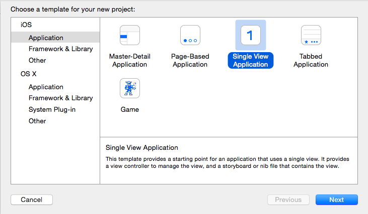
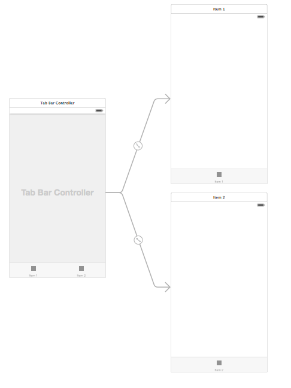
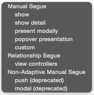

Make a New Project, Single View Application:

# Create the Tab Bar Controller

Delete the View Controller

Find the Tab Bar Controller in the lower-right list of UI Elements, then drag it onto the canvas

Tip: We can ctrl-click canvas to bring up the zoom menu and zoom out or in.  

Select the Tab Bar Controller, and in the right panel in the properties section,
- In Simulated Metrics, choose a size to match your devices
- Check 'is Initial View Controller'

Run

## Name the tabs
Select the tab bar item (either in the left list view or on the layout view)

then in the properties panel (on the right), type the name in Bar Item section, Title field

## Add images
In the file list on the left side, select Image.xcassets, then we can drag in the images of our screens from our Finder window into Xcode.

Then back in the storyboard, find an ImageView

and drag onto on of the tab ViewControllers, and choose an image for it

and again for the second tab:

Now here's what I've got for my first two tabs:

  

## Add a third tab

Ctrl-Click and drag from the Tab bar Controller to our new ViewController, a popup menu will appear:

Choose "View Controllers" under "Relationship Segue"
and a new arrow will appear

Drag in an image view and name the tab, add the image for the third tab

Run -- tabs work but things are sized incorrectly

## Sizing the Screens
Size classes are a new feature of iOS 8 and Xcode 6, allowing you to have one storyboard for universal apps.

Select an ImageView for one of the tabs, Under menu Editor > Pin >
- Top Space to Superview
- Leading Space to Superview
- Trailing Space to Superview
- Bottom Space to Superview

Do this for each image

## Adding Tab Icons

The images for tab bars and toolbars are actually alpha masks, not complete images. Only the alpha channel of the image is used.

With preview, we can use the magic want to create an image with an alpha channel

Drag the icons into xcassets

Set the image of each tab

We should see it change like this:

Now our prototype app has three tabs:

