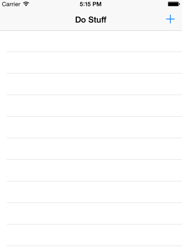

UITableView can display and edit a list of data. It can be displayed vertically but not horizontally. Each item in the table is displayed as a UITableViewCell.

This tutorial goes through the steps for creating a simple list as its own project, but you can also use these steps to add a tableview and details screen into another app within a tab bar or after a log in screen.  (Screenshots are from Xcode 6.2 / Yosemite, but should be similar to later 6.x versions of Xcode.  Note that early versions of Xcode 6 had bugs )

Create a new project.  Choose "Single View Application."


The initial project screen will look like this:


The project starts with a ViewController, but we want to use a different kind of controller, so click on Main.storyboard, select the View Controller and delete:


Then select a Navigation Controller (in the lower-right)...


and drag onto the canvas, then select iPhone size for the simulated metrics:


which makes it easier to work with in storyboard view:


Run


Need to set the Navigation Controller as the Initial View Controller.


Now, when you run the app, you should see:


Give your table view a title:


Now we need to create the companion code files to go with the tableview, and another for the view to add an item to the list.


Now we'll make a custom UIViewController for the screen to create a new list item:


Drag out a ViewController and specify the custom class:


## Create the Add Button [+]


## Connect the Add button to the new item view





## Add cancel and save buttons to the new item view


## Change View When Cancel / Save 

In the ListTableViewController, add
```
@IBAction func unwindToNoteTableViewController(segue: UIStoryboardSegue) {
}
```
before the last } at the end of the file.

Ctrl-drag from "Cancel" to the Exit icon and choose "unwindToNoteTableViewController" from the menu.
You can do the same with "Save" which works for a mock up -- later you would need to write code to actually save the data.

## Create new item view elements

Ctrl-click on the Text Field and drag to the left edge of the View.  Then select from the popup menu:
- Leading Space to Controller Margin

Do the same with the right edge, selecting "Trailing Space to Controller Margin"


Do the same with the top edge, selecting "Top Space to Layout Guide"

Run, rotate the phone simulator (command-arrow) and see the text field resize.

Add a label, ctrl-drag up, select "Top Space to Layout Guide"
now ctrl-drag up again, choose "Center Horizontally in Container"
